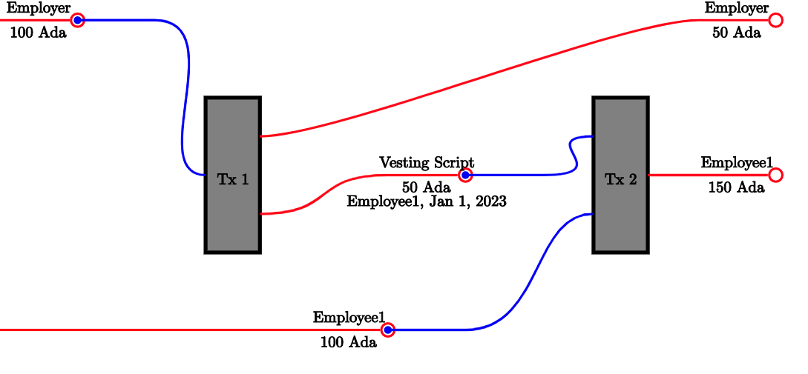

# Vesting DApp

This is a simple DApp that allows you to create a vesting schedule for ADA. It is built using NextJS whit the MeshJS library.

The intent of this project is to showcase how to create off-chain code using MeshJS and to practice it. For that reason, there's a `without-off-chain` branch that has all the setup and web2 wiring done but it misses key web3 components that you can try to implement yourself.


      
## Getting Started

1. Switch to the `without-off-chain` branch:
```bash
git checkout without-off-chain
```

2. Install dependencies:
```bash
pnpm i
```

3. Start project locally:
```bash
pnpm run dev
```

4. Try to implement the missing functionality

## Learn More About MeshJS

### [APIs](https://meshjs.dev/apis)

From wallet integrations to transaction builders, Mesh makes Web3 development easy with reliable, scalable, and well-engineered APIs & developer tools.

### [Guides](https://meshjs.dev/guides)

Whether you are new to web development or a seasoned blockchain full-stack developer, these guides will help you get started.

### [Smart Contracts](https://meshjs.dev/smart-contracts)

Open-source smart contracts, complete with documentation, live demos, and end-to-end source code.

### [React components and hooks](https://meshjs.dev/react)

Frontend components for wallet connections, and useful React hooks to getting wallet states - Mesh provides everything you need to bring your Web3 user interface to life.
